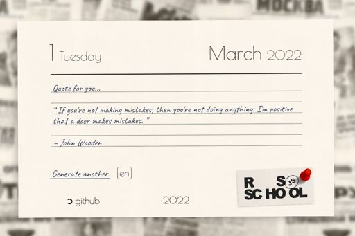
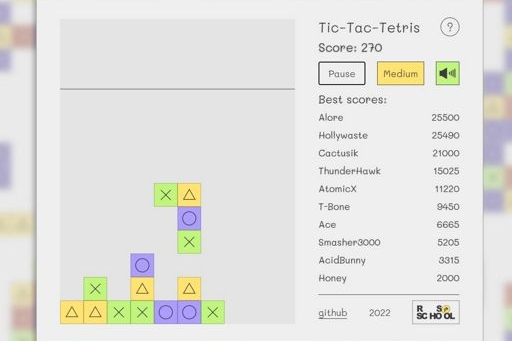

### Aliaksei Paliukhovich

---

### Contacts
- Tel: +375 44 701 20 23
- Mail: alex.teanow@gmail.com
- Discord: heh#3294 (Alex (@alexPalx))


### About Me

Hello. My name is Alexei, I am 21 years old, I live in Minsk, Belarus. I love programming for a very long time. However, it was not possible to get the desired education for certain reasons. Therefore, I am engaged in self-education. During the time of self-study, I managed to make several prototypes of games on Unity, the code of which I am ashamed to show people :) But I want to become a web developer, so I'm learning programming at ***RS School***!


### Skills

- HTML
- CSS
- JavaScript Basics
- C# Basics
- Git and GitHub Basics


### Code Example

``` JavaScript
const towerBuilder = (floors, blockType = '*') => {
    return (new Array(floors)).fill().map((_, i) =>
        blockType
            .repeat((i + 1) * 2 - 1)
            .padStart(floors + i, ' ')
            .padEnd(floors * 2 - 1, ' ')
    );
};
```


### My projects

- [Portfolio example<br>](https://alexpalx.github.io/rss-stage0-projects/portfolio/)
- [Audio player<br>](https://alexpalx.github.io/rss-stage0-projects/audio-player/)
- [Quote generator<br>](https://alexpalx.github.io/rss-stage0-projects/random-jokes/)
- [Strange game<br>](https://alexpalx.github.io/rss-stage0-projects/random-game/)


### Work Experience

No experience in IT.


### Education

Secondary special education, Minsk State Energy College, heating engineer.
As well as various starter courses and books on HTML, CSS, JavaScript, C#, and more.

### Language

- Russian, Belarusian - Native
- English - A2